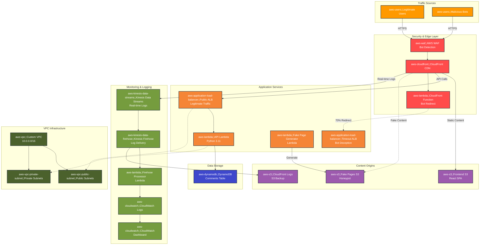

# Bot Deception Web Application

A sophisticated AWS-based web application designed to demonstrate advanced bot detection and deception techniques using modern cloud infrastructure. This project showcases how to build a production-ready application with comprehensive monitoring, security, and bot mitigation strategies.

## 🎯 Project Overview

This application demonstrates a multi-layered approach to bot detection and deception:

- **Frontend**: Modern React SPA with AWS Cloudscape Design System
- **Backend**: Serverless Python Lambda functions
- **Security**: AWS WAF v2 with Bot Control managed rules
- **Deception**: Dynamic fake page generation and bot redirection
- **Monitoring**: Real-time logging with CloudWatch and Kinesis
- **Infrastructure**: Fully automated Terraform deployment

## 🏗️ Architecture

### High-Level Architecture
```
Internet → CloudFront → WAF → ALB → Lambda Functions
                     ↓
                S3 Buckets (Frontend + Fake Pages)
                     ↓
                DynamoDB + Kinesis + CloudWatch
```

### Detailed Architecture Diagram



### Key Components

#### **Frontend Layer**
- **CloudFront Distribution**: Global CDN with edge locations
- **S3 Static Hosting**: React SPA with optimized caching
- **CloudFront Functions**: Bot detection and redirection logic

#### **Security Layer**
- **AWS WAF v2**: Bot Control with managed rule sets
- **Rate Limiting**: IP-based request throttling
- **Custom Rules**: Targeted bot detection patterns

#### **Application Layer**
- **Application Load Balancer**: Traffic distribution and health checks
- **Lambda Functions**: Serverless API endpoints
- **DynamoDB**: NoSQL database for application data

#### **Monitoring Layer**
- **Kinesis Data Streams**: Real-time log ingestion
- **CloudWatch**: Metrics, alarms, and dashboards
- **Real-time Logging**: Comprehensive request tracking

## 🚀 AWS Workshop Studio Integration

This project is designed for use in **AWS Workshop Studio** environments, providing hands-on experience with:

### Learning Objectives
- **Serverless Architecture**: Build and deploy serverless applications
- **Bot Detection**: Implement advanced bot mitigation strategies
- **Infrastructure as Code**: Use Terraform for reproducible deployments
- **Monitoring & Observability**: Set up comprehensive logging and alerting
- **Security Best Practices**: Apply AWS security services and patterns

### Workshop Prerequisites
- AWS Account with appropriate permissions
- Basic knowledge of AWS services (Lambda, S3, CloudFront)
- Familiarity with Terraform and Infrastructure as Code
- Understanding of web application architecture

### Workshop Duration
- **Estimated Time**: 2-3 hours
- **Difficulty Level**: Intermediate to Advanced
- **Target Audience**: Cloud architects, developers, security engineers

## 📁 Project Structure

```
├── README.md                    # This file
├── terraform/                   # Infrastructure as Code
│   ├── main.tf                 # Primary Terraform configuration
│   ├── variables.tf            # Variable definitions
│   ├── terraform.tfvars        # Configuration values
│   └── README.md               # Terraform-specific documentation
├── source/                     # Application source code
│   ├── frontend/               # React SPA
│   │   ├── src/               # React components and logic
│   │   ├── package.json       # Node.js dependencies
│   │   └── vite.config.js     # Build configuration
│   └── backend/               # Lambda functions
│       ├── api_lambda.py      # Main API handler
│       └── fake_page_lambda.py # Fake page generator
├── scripts/                   # Utility scripts
└── .devcontainer/            # VS Code development container
```

## 🛠️ Infrastructure Components

### AWS Services Used

| Service | Purpose | Configuration |
|---------|---------|---------------|
| **CloudFront** | Global CDN and edge security | Real-time logging, custom functions |
| **AWS WAF v2** | Web application firewall | Bot Control, rate limiting, custom rules |
| **Application Load Balancer** | Traffic distribution | Health checks, Lambda integration |
| **Lambda** | Serverless compute | Python 3.11, API Gateway integration |
| **S3** | Static hosting and storage | Frontend assets, fake pages |
| **DynamoDB** | NoSQL database | Comments and application data |
| **Kinesis** | Real-time data streaming | CloudFront logs, analytics |
| **CloudWatch** | Monitoring and alerting | Dashboards, alarms, log aggregation |
| **VPC** | Network isolation | Public/private subnets, NAT Gateway |

### Key Features

#### **🤖 Bot Detection & Deception**
- **Multi-layer Detection**: WAF rules + CloudFront functions + custom logic
- **Dynamic Fake Pages**: AI-generated content to confuse bots
- **Honeypot Paths**: Hidden links and resources to trap crawlers
- **Behavioral Analysis**: Request pattern recognition

#### **📊 Real-time Monitoring**
- **Comprehensive Logging**: All requests logged to Kinesis
- **Custom Metrics**: Bot detection counts, error rates, performance
- **Automated Alerts**: CloudWatch alarms for anomalies
- **Visual Dashboards**: Real-time monitoring interface

#### **🔒 Security Features**
- **Origin Access Control**: Secure S3 access via CloudFront
- **IAM Least Privilege**: Minimal required permissions
- **Encryption**: Data encrypted in transit and at rest
- **Network Isolation**: VPC with proper subnet segmentation

## 🚀 Quick Start

### Prerequisites
- AWS CLI configured with appropriate credentials
- Terraform >= 1.0 installed
- Node.js >= 18 and npm installed

### Deployment Steps

1. **Clone the Repository**
   ```bash
   git clone <repository-url>
   cd website-3
   ```

2. **Configure Terraform Variables**
   ```bash
   cd terraform
   cp terraform.tfvars.example terraform.tfvars
   # Edit terraform.tfvars with your configuration
   ```

3. **Deploy Infrastructure**
   ```bash
   terraform init
   terraform plan
   terraform apply
   ```

4. **Access the Application**
   ```bash
   # Get the CloudFront URL from Terraform output
   terraform output deployment_urls
   ```

### Expected Deployment Time
- **Infrastructure**: ~15-20 minutes
- **CloudFront Distribution**: ~10-15 minutes
- **Total**: ~25-35 minutes

## 📈 Monitoring & Observability

### CloudWatch Dashboard
The deployment creates a comprehensive monitoring dashboard with:
- **Traffic Metrics**: Requests, bytes transferred, cache hit rates
- **Error Rates**: 4xx/5xx error tracking and alerting
- **Bot Detection**: Real-time bot activity monitoring
- **Performance**: Origin latency and response times

### Alarms Configured
- 4xx error rate > 10%
- 5xx error rate > 5%
- Cache hit rate < 80%
- Origin latency > 3 seconds
- High bot detection rate > 10 per 5 minutes
- Kinesis stream errors > 0
- Kinesis high utilization > 1000 records per 5 minutes

### Log Analysis
- **Real-time Logs**: Streamed to Kinesis for immediate analysis
- **Log Retention**: Configurable retention periods
- **Custom Metrics**: Extracted from log patterns
- **Searchable Logs**: CloudWatch Logs Insights integration

## 🧪 Testing & Validation

### Functional Testing
```bash
# Test main application
curl https://your-cloudfront-domain.com

# Test API endpoints
curl https://your-cloudfront-domain.com/api/status
curl https://your-cloudfront-domain.com/health

# Test bot detection
curl -A "BadBot/1.0" https://your-cloudfront-domain.com
```

### Load Testing
```bash
# Use tools like Apache Bench or Artillery
ab -n 1000 -c 10 https://your-cloudfront-domain.com/
```

### Security Testing
- WAF rule validation
- Bot detection accuracy
- Rate limiting effectiveness
- Origin protection verification

## 🔧 Customization

### Configuration Options
- **Bot Detection Sensitivity**: Adjust WAF rules and thresholds
- **Fake Page Content**: Customize generated content templates
- **Monitoring Thresholds**: Modify alarm conditions
- **Performance Settings**: Tune Lambda memory and timeout
- **Caching Behavior**: Adjust CloudFront cache policies

### Environment Variables
```bash
# Frontend configuration
VITE_API_BASE_URL=/api
VITE_CLOUDFRONT_DOMAIN=your-domain.com
VITE_NODE_ENV=production

# Lambda configuration
LOG_LEVEL=INFO
DYNAMODB_TABLE_NAME=bot-deception-dev-comments
```

## 🛡️ Security Considerations

### Best Practices Implemented
- **Principle of Least Privilege**: Minimal IAM permissions
- **Defense in Depth**: Multiple security layers
- **Encryption**: TLS 1.2+ enforced, data encryption
- **Network Security**: VPC isolation, security groups
- **Monitoring**: Comprehensive logging and alerting

### Security Recommendations
- Regularly update WAF rules
- Monitor and analyze bot patterns
- Review CloudWatch alarms and metrics
- Implement additional custom detection rules
- Regular security assessments

## 📚 Learning Resources

### AWS Documentation
- [AWS WAF Developer Guide](https://docs.aws.amazon.com/waf/)
- [CloudFront Developer Guide](https://docs.aws.amazon.com/cloudfront/)
- [Lambda Developer Guide](https://docs.aws.amazon.com/lambda/)
- [Terraform AWS Provider](https://registry.terraform.io/providers/hashicorp/aws/)

### Related Workshops
- AWS Security Workshops
- Serverless Application Development
- Infrastructure as Code with Terraform
- CloudFront and CDN Best Practices

## 🤝 Contributing

This project is designed for educational purposes in AWS Workshop Studio. Contributions and improvements are welcome:

1. Fork the repository
2. Create a feature branch
3. Make your changes
4. Test thoroughly
5. Submit a pull request

## 📄 License

This project is licensed under the MIT License - see the LICENSE file for details.

## 🆘 Support

For workshop-related questions or issues:
- Check the troubleshooting section in `terraform/README.md`
- Review CloudWatch logs and metrics
- Consult AWS documentation
- Contact workshop facilitators

## 🏷️ Tags

`aws` `terraform` `serverless` `bot-detection` `cloudfront` `waf` `lambda` `workshop` `security` `monitoring`

---

**Built for AWS Workshop Studio** | **Infrastructure as Code** | **Production Ready**
